## Overview

Real Estate Tycoon is the most architecturally complete game I built in this course. It runs entirely in the browser with no server dependency beyond static file hosting, and combines a full MVC separation, real-time market simulation, a negotiation battle mechanic for property acquisition, and a complete financial management layer backed by `localStorage` persistence.

The game starts the player with $500,000 in capital. The win condition is reaching $5,000,000 in net worth by buying, upgrading, and selling properties across three market tiers. Properties are acquired through negotiation battles against broker NPCs — each battle determines the purchase discount the player receives. Market prices shift continuously via Brownian motion and periodic economic events that ripple across categories through a directed influence graph.

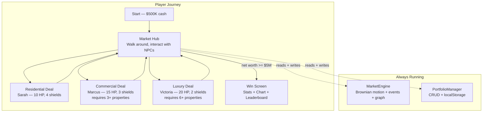

---

## Directory Structure

```
_projects/real-estate-tycoon/
├── Makefile
├── levels/
│   ├── GameLevelMarketHub.js      # Main game world
│   ├── GameLevelPropertyDeal.js   # Base negotiation battle class
│   ├── GameLevelResidential.js    # Residential tier deals
│   ├── GameLevelCommercial.js     # Commercial tier deals
│   ├── GameLevelLuxury.js         # Luxury tier deals
│   └── GameLevelWinScreen.js      # Victory screen + leaderboard
├── model/
│   ├── PortfolioManager.js        # Financial state + localStorage
│   ├── MarketEngine.js            # Live market simulation
│   └── PropertyDatabase.js        # 17-property catalog + search/sort
├── images/
│   ├── city_background.svg        # Main city skyline
│   ├── bg_residential.svg         # Residential deal background
│   ├── bg_commercial.svg          # Commercial deal background
│   ├── bg_luxury.svg              # Luxury deal — sunset beach
│   ├── player_investor.svg        # Player character sprite
│   ├── broker_residential.svg     # Sarah NPC
│   ├── broker_commercial.svg      # Marcus NPC
│   ├── broker_luxury.svg          # Victoria NPC
│   ├── bank_manager.svg           # Bank NPC
│   └── property_manager.svg       # Alex NPC
└── docs/
    └── REAL-ESTATE-TYCOON.md
```

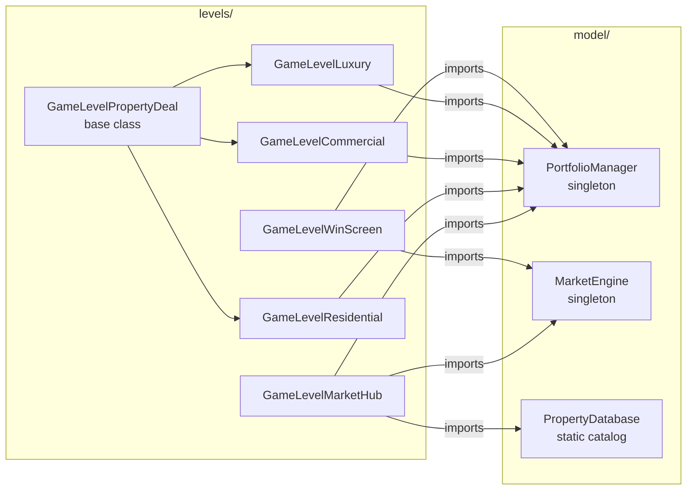

---

## Game Systems

### Market Engine — MarketEngine.js

The market engine is a singleton that drives all price simulation in the game. It runs on the browser's animation frame loop, called by the hub level's `update()` method every frame. Three market categories — residential, commercial, luxury — each maintain a price multiplier that the engine continuously adjusts.

**Brownian motion with mean-reversion** — Each tick, the engine adds a random delta in [-0.02, +0.02] to the category multiplier, then applies a 0.1% pull back toward 1.0. Without mean-reversion, prices drift to extremes over time; without the random delta, they converge to exactly 1.0 and stay there. Hard clamps at [0.55, 2.2] prevent runaway values.

**Event scheduling via FIFO queue** — Instead of triggering events randomly each time, the engine pre-fills an `EventQueue` with a Fisher-Yates shuffle of all 10 event types. Events dequeue in that shuffled order, so every event fires exactly once before any can repeat. The queue auto-refills when empty.

**Market influence graph** — When an event fires on one category, a one-hop traversal of `INFLUENCE_GRAPH` applies weighted spillover to adjacent categories. A residential boom nudges commercial; commercial growth lifts luxury demand. This models real cross-sector market behavior without hardcoding per-event cross-effects.

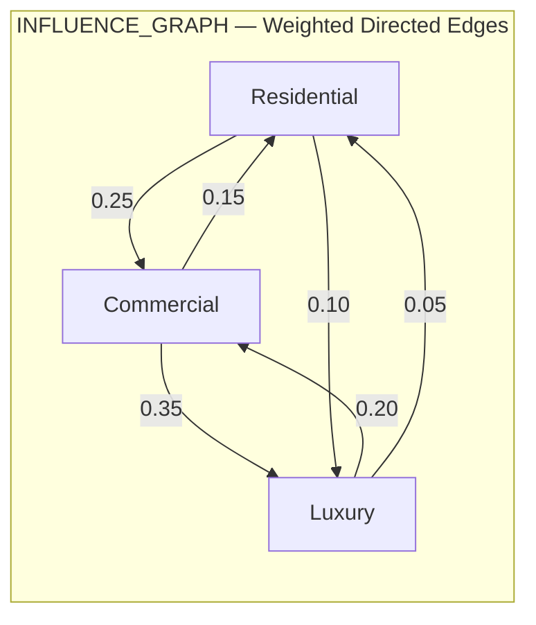

The edge weights were calibrated through playtesting. The first attempt used weights around 0.5–0.8, which caused compounding spikes that hit the 2.2x ceiling almost immediately. The final weights keep cross-category effects noticeable but not dominant — a residential housing boom is felt in commercial prices, but not so strongly that it overrides commercial's own random walk.

**Price history buffer** — The engine maintains a ring buffer of up to 60 data points per category. This history is consumed by the Win Screen's Canvas chart to draw the three-line price history graph.

**localStorage caching** — Market state (current multipliers, event queue position, price history) is written to `localStorage` with a 5-minute TTL. Refreshing the page mid-game restores market state rather than resetting it.

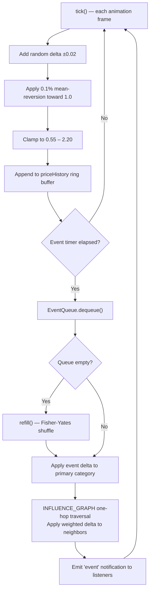

---

### Portfolio Manager — PortfolioManager.js

PortfolioManager is the sole source of truth for all financial state. It is the only class that reads from or writes to `localStorage` for portfolio data. All level code accesses financial state through this singleton's public API.

**Starting capital:** $500,000

| Operation | What it does | Complexity |
|-----------|-------------|------------|
| `buyProperty(id, price)` | Deducts cash, adds property to portfolio array | O(1) |
| `sellProperty(id)` | Returns market-adjusted price, removes from portfolio | O(n) search |
| `upgradeProperty(id)` | Level up to 3; costs 15–45% of purchase price; rent +30% | O(n) search |
| `takeLoan(amount)` | Adds cash, adds debt. Hard cap: 65% of net worth at 6.5% APR | O(1) |
| `collectRent()` | Prorated by elapsed time — 1 real minute equals 1 game day | O(k) properties |
| `getNetWorth()` | Cash + sum(price × multiplier) − totalDebt | O(k) properties |
| `getLeaderboard()` | Top-10 array sorted by score from localStorage | O(1) |

**Net worth formula:**

```
netWorth = cash
         + sum( property.purchasePrice × market.getMultiplier(property.type) )
           for each property in portfolio
         − totalDebt
```

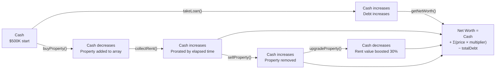

**Transaction log** — Every buy, sell, upgrade, and loan is pushed to `_transactions[]`. The array is treated as a LIFO stack: `peekLastTransaction()` returns `_transactions[_transactions.length - 1]` in O(1). The full array is available for history iteration.

**Persistence invariant** — Every mutating method calls `_persist()` as its final step. This means the in-memory state and the localStorage state are always in sync. If the page is refreshed at any point, `_load()` restores the exact state the player had.

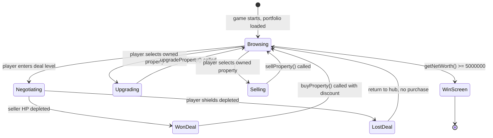

---

### Property Database — PropertyDatabase.js

The property database is a static catalog of 17 properties across three market tiers. It is imported as a plain module (not a singleton) since its data never changes at runtime — it only provides querying methods.

| Type | Count | Price Range | Monthly Rent |
|------|-------|-------------|--------------|
| Residential | 6 | $145K – $1.4M | $1,150 – $11,000 |
| Commercial | 6 | $210K – $2.8M | $2,100 – $32,000 |
| Luxury | 5 | $3.2M – $18M | $24,000 – $175,000 |

**Initialization** — On first import, all 17 properties are sorted by price into `ALL_SORTED` via a comparator sort (O(n log n), paid once). This pre-sorted array is never modified at runtime; it is only read.

**`searchByPriceRange(min, max)`** — Runs a lower-bound binary search on `ALL_SORTED` to find the first index where `price >= min` (O(log n)), then walks forward collecting entries while `price <= max` (O(k) where k is the result count). Total complexity: O(log n + k).

**`getUnowned(portfolio)`** — Builds a `Set` of owned property IDs from the portfolio (O(k) where k is portfolio size), then filters the full catalog using `Set.has()` for each entry (O(1) per check). This was refactored from an original O(n²) implementation that called `Array.includes()` inside a filter loop.

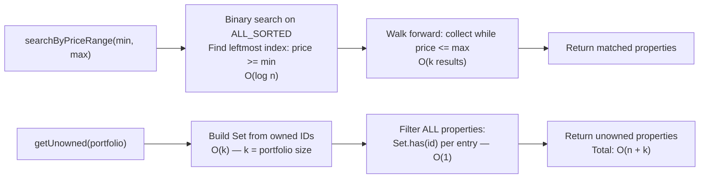

---

### Negotiation Battle — GameLevelPropertyDeal.js

The negotiation battle is how players acquire properties. Each deal level subclasses `GameLevelPropertyDeal` with different difficulty parameters.

The framing: the broker NPC (seller) fires counter-offers (red lasers) at the player. The player fires offers (cyan lasers) at the seller to deplete their HP. Inspection documents scattered on the ground give a 1% purchase discount each when collected. When seller HP reaches 0, the deal closes at the total accumulated discount.

**Difficulty scaling by tier:**

| Tier | Seller HP | Player Shields | Counter-Offer Interval | Max Discount |
|------|-----------|----------------|------------------------|--------------|
| Residential | 10 | 4 | 1.8 seconds | 5% (5 documents) |
| Commercial | 15 | 3 | 1.3 seconds | 5% (5 documents) |
| Luxury | 20 | 2 | 1.0 seconds | 5% (5 documents) |

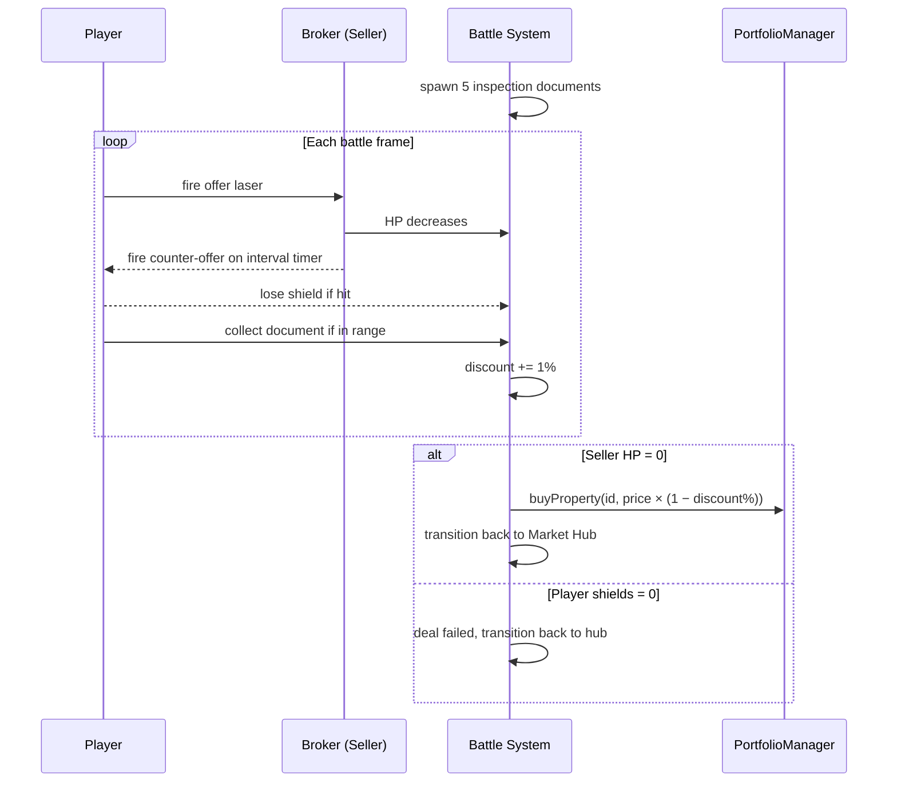

The discount accumulates as the player collects documents during the battle. A player who collects all five documents and defeats the seller earns a 5% purchase price reduction on top of whatever the current market multiplier is. This adds a navigation layer to the combat mechanic — players who ignore the documents and just fire at the seller miss out on savings.

---

### Market Hub — GameLevelMarketHub.js

The hub is the main game world. It is the level the player returns to after every deal and spends the most time in. Six systems run concurrently from the same animation frame loop.

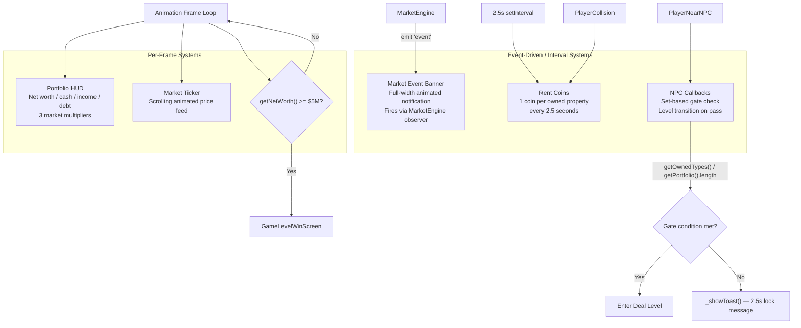

**HUD implementation** — The HUD is a DOM overlay rather than a Canvas element. It is updated by directly writing to pre-built DOM nodes each frame via `innerText`. At 60fps this is fast enough; if the game ever targets 120fps, throttling to every other frame would be worth considering.

**Visibility management** — When the player enters a deal level, `_setUiVisible(false)` sets `display: none` on all HUD and ticker DOM elements. Without this, those elements render on top of the deal level canvas, which was the original bug. When the player returns, `parentControl.resume` fires and `_setUiVisible(true)` restores them.

**NPC gate system** — Marcus (Commercial) and Victoria (Luxury) use `PortfolioManager.getPortfolio().length` to check the total property count. If the gate fails, `_showToast()` renders a temporary message for 2.5 seconds describing the requirement. No modal, no pause — the game keeps running while the toast is visible.

---

## Progression System

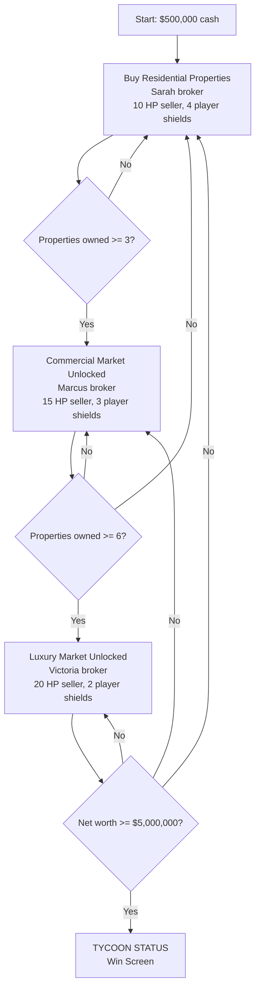

Players are not locked out of lower tiers once higher ones unlock. Mixing property types is often the optimal strategy — commercial properties generate significantly higher monthly rent and benefit from residential market event spillover. A player who buys only luxury properties faces higher deal difficulty and loses faster if the luxury multiplier drops.

---

## Win Screen — GameLevelWinScreen.js

The win screen has three main components.

**Stats panel** — Eight stat cards covering final net worth, time elapsed, total properties purchased, total sold, peak net worth during the run, total rent collected, total loans taken, and final debt. All values are read from `PortfolioManager` getter methods.

**Portfolio breakdown** — A table listing each currently owned property with its type, current market-adjusted value, and monthly rent output.

**Top-10 leaderboard** — Scores from `localStorage`, ranked by final net worth. Each entry shows player name, score, and time elapsed. The leaderboard persists across game resets — "Play Again" resets the portfolio but does not wipe the leaderboard.

**Market history chart** — An HTML5 Canvas chart drawn without any external charting library. It reads the 60-point price history ring buffer from `MarketEngine.getPriceHistory()` and renders three polylines (one per market category) with axis labels, tick marks, and a legend. This is the most visually complex piece of the project and required the most Canvas API research.

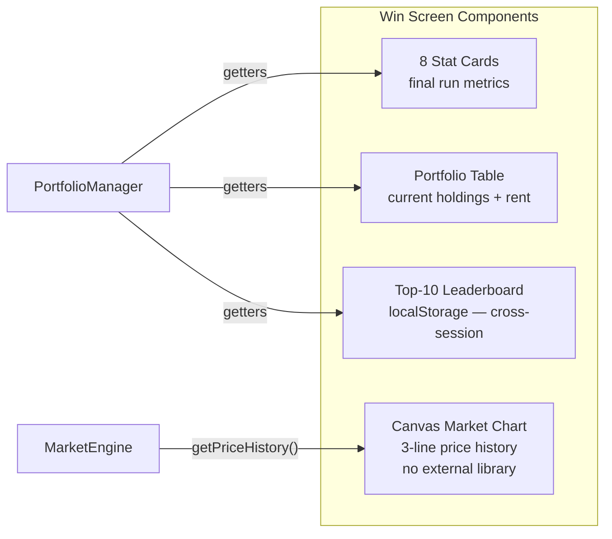

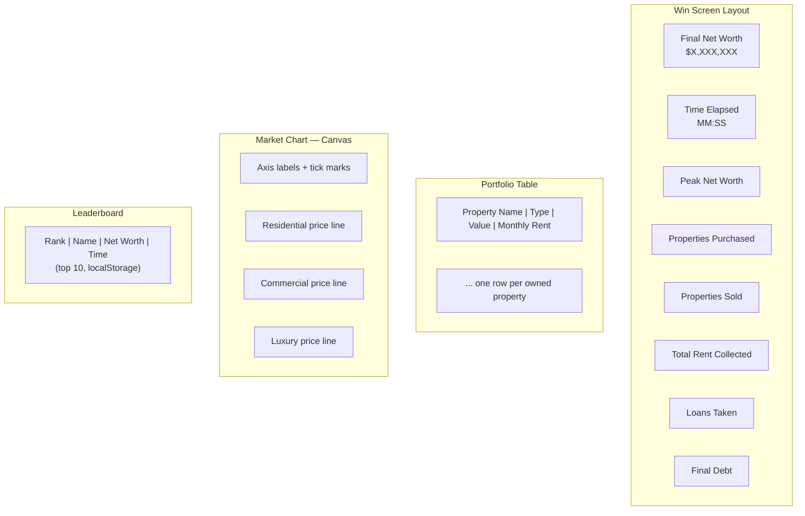

---

## Data Flow Summary

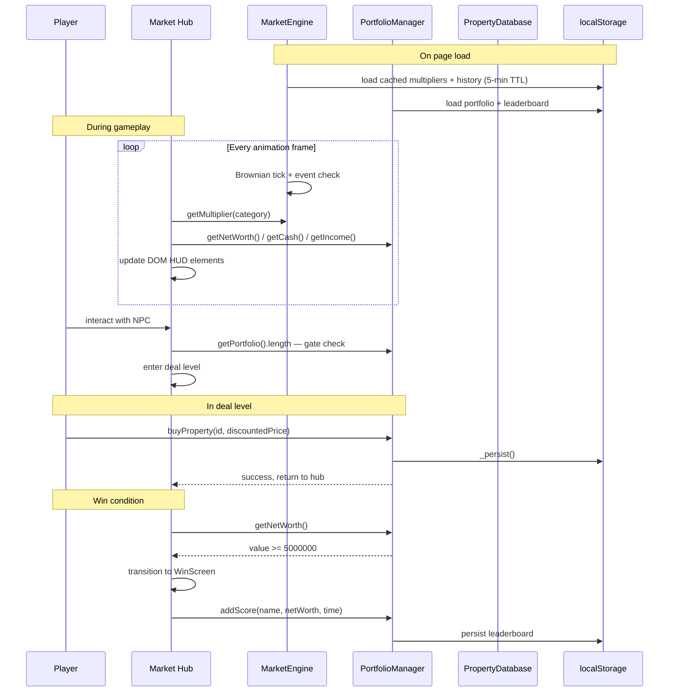
