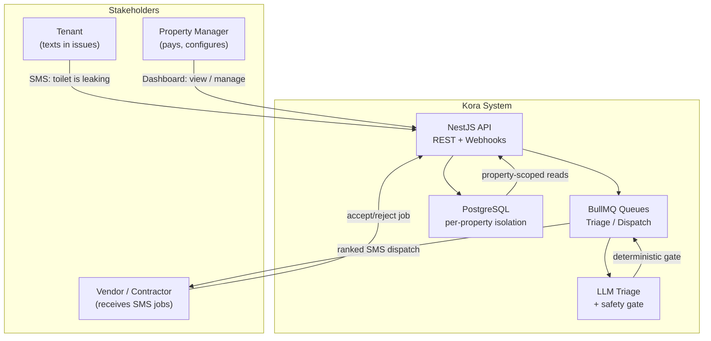
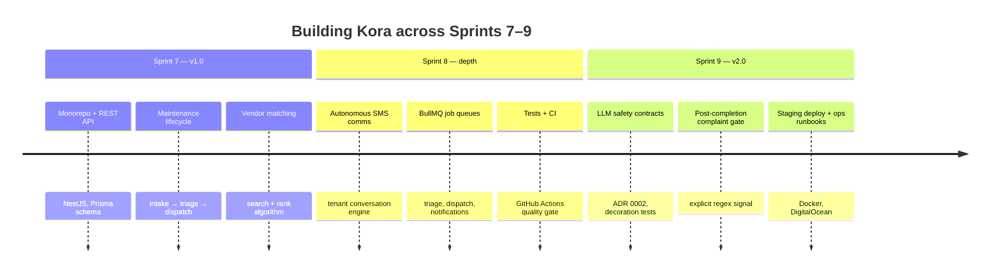
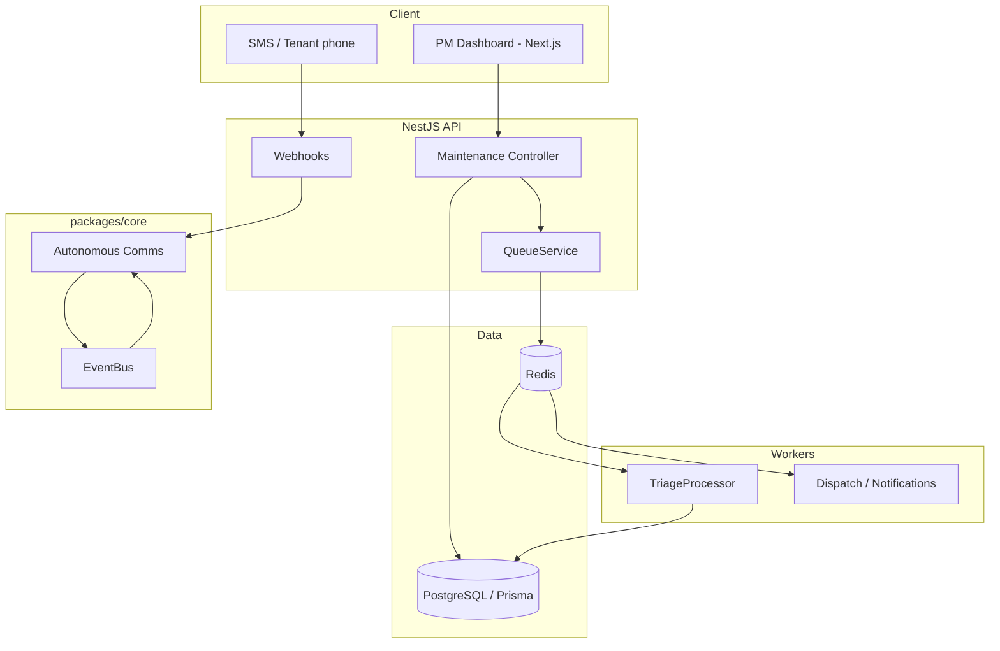
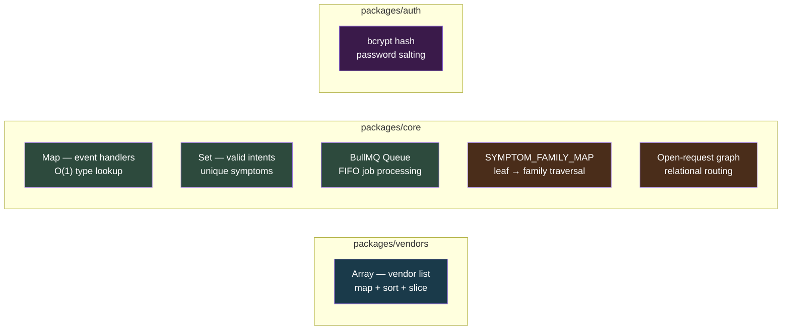
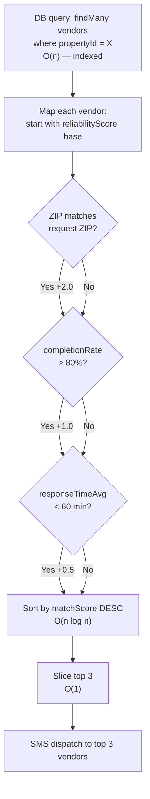
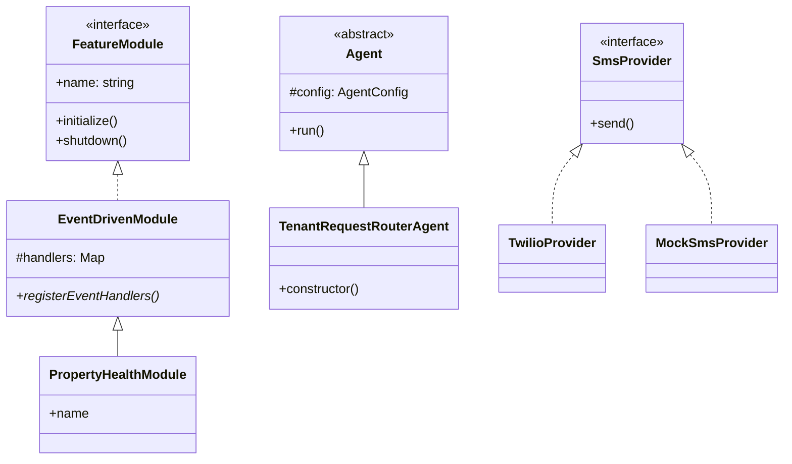
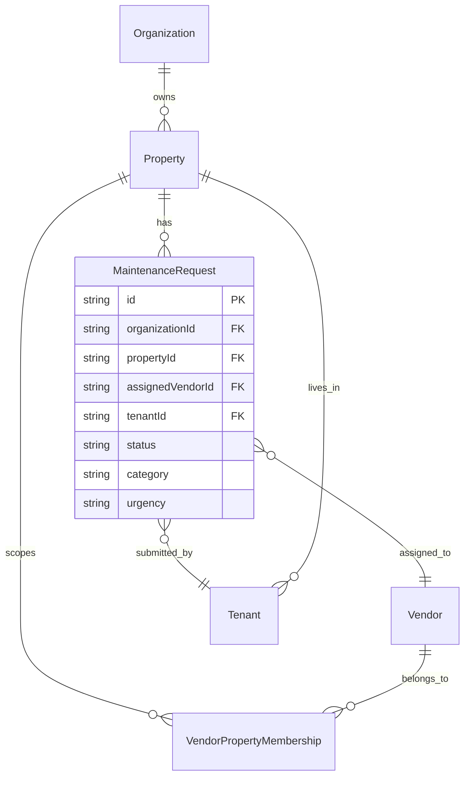
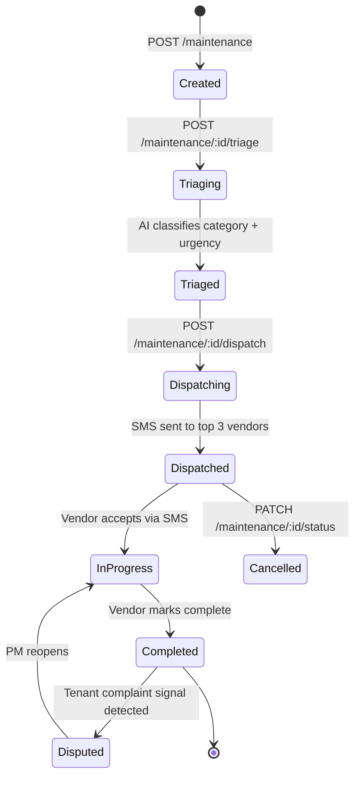
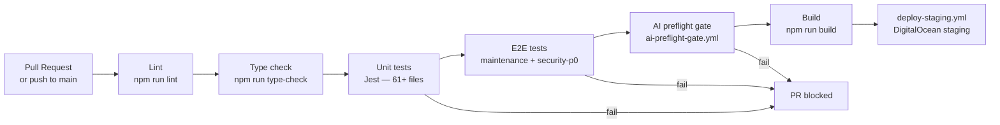
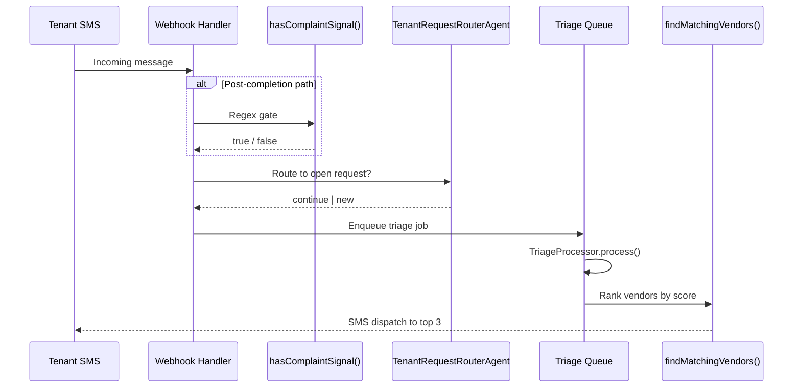

**Course:** CSA / CS 113 (Mira Costa College articulation)  
**Project:** [Kora](app.getkoratech.com) — Autonomous Property Maintenance OS  
**Repository:** `vastu-1` monorepo (TypeScript, NestJS, Next.js, PostgreSQL)  
**Last updated:** May 2026

---

## Executive Summary

This year I did not build a toy CRUD app. I built **Kora** — software that helps property managers run maintenance when tenants text "the toilet is leaking" at 11pm. Kora takes the message, triages urgency, matches vendors, dispatches via SMS, and tracks the job to completion — with strict isolation per building so one property's outage does not affect another.

The rubric lists Java Spring Boot and JUnit. My stack is the **same engineering ideas in a production TypeScript monorepo**: NestJS (REST API), Prisma (ORM + entities), Jest (61+ test files), Docker Compose, GitHub Actions CI, and custom domain deployment. The concepts — collections, queues, sorting, hashing, OOP, APIs, databases, containers — are what CS 113 measures; the language is how I ship Kora in the real world.

---

## Why This Problem Matters

Renters depend on maintenance response time. A slow or wrong dispatch wastes money (duplicate truck rolls), erodes trust, and can leave safety issues — gas leaks, flooding, heat outages — unaddressed for too long. Kora targets **equity through reliability**: the same automated intake and dispatch whether the building is 50 units or 5,000.

Ethical choices are in the code, not just the slide deck:

| Risk | What we built | Where |
|------|--------------|-------|
| AI reopens wrong ticket | Deterministic **complaint signal** gate before destructive actions | `complaint-signal.ts` |
| AI parrots bad confidence | **ADR 0002** + decoration tests | `docs/decisions/0002-llm-design-contracts.md` |
| Cross-property data leak | **Property-atomic** architecture | README, Prisma `propertyId` on every request |
| Password exposure | **bcrypt** hashing | `@vastu/auth` |



---

## My Arc Through the CS Year



Early in the year I focused on **fundamentals**: data types (JSON payloads, Prisma models), control flow (status machines, `try/catch` on webhooks), and REST endpoints. Mid-year I moved into **data structures at scale** — maps for event handlers, sets for deduping symptoms, queues for async triage. Late year I owned **systems thinking**: when an LLM looked like it was working but was ignored in production (the "0.54 confidence" incident), I documented it in an ADR and changed how we design AI features.

---

## System Architecture



**Property-atomic rule:** every `MaintenanceRequest` carries `organizationId` + `propertyId`. Vendors are matched through `VendorPropertyMembership`, not a global vendor list — that is **grouping / wayfinding** at the data layer: "which vendors belong to *this* building?"

---

## CS 113 Alignment — Evidence from Kora

### Data Structures

| Objective | Kora evidence | Method / file |
|-----------|--------------|---------------|
| **Lists** | Load vendors for a property, map to ranked list, slice top N | `findMatchingVendors()` |
| **Maps / dictionaries** | Event type to handler; symptom to family | `EventDrivenModule.handlers`, `SYMPTOM_FAMILY_MAP` |
| **Sets** | Unique symptoms, valid LLM intents, safe HTTP methods | `new Set()` in tenant-handler, classifiers |
| **Queues** | Async triage, dispatch, notifications (FIFO job processing) | BullMQ `QueueService`, `TriageProcessor` |
| **Trees** | Symptom ontology: keys to families, implication rules | `symptom-ontology.ts` |
| **Graphs** | Request routing among *open* requests (relational routing) | `TenantRequestRouterAgent` |



#### Lists + Sorting — Vendor Matching

We **search** the database for property-scoped vendors, **score** each row, **sort** by `matchScore`, and return the top 3 for SMS dispatch.

```typescript
// packages/vendors/src/matching.ts — lines 72–97
const rankedVendors = vendors
    .map((vendor) => {
        let score = vendor.reliabilityScore || 5.0;

        // Boost score for exact ZIP match
        if (vendor.zip === zip) {
            score += 2.0;
        }

        // Boost score for high completion rate
        if (vendor.completionRate && vendor.completionRate > 0.8) {
            score += 1.0;
        }

        // Boost score for fast response time
        if (vendor.responseTimeAvg && vendor.responseTimeAvg < 60) {
            score += 0.5;
        }

        return {
            ...vendor,
            matchScore: score,
        };
    })
    .sort((a, b) => b.matchScore - a.matchScore)
    .slice(0, limit);
```

**Complexity:** Let *n* = vendors on a property. Filtering is O(*n*) via one query; scoring and sort are O(*n* log *n*). For typical *n* < 50, this is dominated by network/DB latency, not CPU.



#### Maps — Event-Driven Modules

```typescript
// packages/core/src/modules/base-module.ts — lines 51–76
export abstract class EventDrivenModule implements FeatureModule {
    abstract name: string;

    private handlers: Map<string, (event: DomainEvent) => Promise<void>> = new Map();
    // ...
        for (const [eventType, handler] of this.handlers) {
            this.eventBus.subscribe(eventType, handler);
        }
```

This is the same idea as `HashMap<String, Handler>` in Java: O(1) average lookup by event type.

#### Queues — Background Jobs

```typescript
// apps/api/src/queue/triage.processor.ts — lines 25–37
@Processor(QUEUES.TRIAGE, { concurrency: queueConfig[QUEUES.TRIAGE]?.concurrency ?? 5 })
export class TriageProcessor extends WorkerHost {
    constructor(private readonly queueService: QueueService) {
        super();
    }

    async process(job: Job<TriageJobPayload>) {
        const { requestId, organizationId, useAgent, source } = job.data;
```

Jobs enter Redis-backed queues so the API returns fast while triage runs asynchronously — classic **producer/consumer** pattern.

#### Tree-Like Structure — Symptom Ontology

Symptoms are leaves; families are internal nodes. `getSymptomsInFamily()` walks the map — same traversal pattern as a shallow tree ADT.

```typescript
// packages/core/src/autonomous-comms/symptom-ontology.ts — lines 8–21
export const SYMPTOM_FAMILY_MAP: Record<SymptomKey, SymptomFamily> = {
    unusual_noise:       'noise_issue',
    water_leak:          'water_issue',
    drainage_issue:      'drainage_issue',
    overflow_risk:       'drainage_issue',
    // ...
};
```

---

### Algorithms

| Algorithm | Where | Notes |
|-----------|-------|-------|
| **Search** | Prisma `findMany` with `where` filters | Indexed columns on `propertyId`, `status` |
| **Sort** | `.sort((a,b) => b.matchScore - a.matchScore)` | Comparator by business score |
| **Hashing** | bcrypt passwords | `hashPassword` / `verifyPassword` tests |
| **Pattern match** | Complaint signal regex | Deterministic gate before reopen |

#### Hashing — Authentication

```typescript
// packages/auth/src/password.test.ts — lines 4–20
    describe('hashPassword', () => {
        it('should hash a password', async () => {
            const password = 'testPassword123';
            const hash = await hashPassword(password);

            expect(hash).toBeDefined();
            expect(hash).not.toBe(password);
            expect(hash.length).toBeGreaterThan(0);
        });

        it('should generate different hashes for same password', async () => {
            const password = 'testPassword123';
            const hash1 = await hashPassword(password);
            const hash2 = await hashPassword(password);

            expect(hash1).not.toBe(hash2);
        });
```

Salting via bcrypt means same password → different hashes → rainbow tables do not apply.

#### Pure Function + Branching — Dispatch Sufficiency

Multi-branch decisions export a **`decisionBranch`** enum so production logs show *why* dispatch was blocked — no silent `if` trees.

```typescript
// packages/core/src/autonomous-comms/dispatch-sufficiency-application.ts — lines 44–50
export type DispatchSufficiencyDecisionBranch =
    | 'llm_safety_block'
    | 'llm_ready_dispatch'
    | 'llm_missing_critical'
    | 'verdict_ignored_low_confidence'
    | 'verdict_ignored_safety_blocked_unconfirmed'
    | 'verdict_ignored_no_actionable_verdict';
```

**Complexity:** Fixed small number of branches → O(1) per evaluation. Tests live in `tests/dispatch-sufficiency-application.test.ts`.

---

### Object-Oriented Design



| OOP Pillar | Kora Example |
|-----------|-------------|
| **Abstraction** | `SmsProvider` interface; `FeatureModule` interface |
| **Encapsulation** | Private `handlers` map on `EventDrivenModule`; NestJS services hide DB details |
| **Inheritance** | `EventDrivenModule` base; `Agent` base for LLM agents |
| **Polymorphism** | `TwilioProvider` vs `MockSmsProvider` both implement `send()` |
| **Patterns** | MVC (controllers/services), Repository (Prisma), Factory (queue registration), Singleton-style `EventBus` |

```mermaid
graph TB
    subgraph "packages/core"
        FeatureModule["FeatureModule\ninterface"]
        EventDrivenModule["EventDrivenModule\nabstract class"]
        PropertyHealthModule["PropertyHealthModule"]
        EventBus["EventBus\nsingleton-style pub/sub"]
        EB2["EventBus"] 
    end

    subgraph "packages/agents"
        Agent["Agent\nabstract class"]
        RouterAgent["TenantRequestRouterAgent"]
    end

    subgraph "packages/notifications"
        SmsProvider["SmsProvider\ninterface"]
        Twilio["TwilioProvider\nproduction"]
        MockSms["MockSmsProvider\ntests"]
    end

    FeatureModule <|.. EventDrivenModule
    EventDrivenModule <|-- PropertyHealthModule
    Agent <|-- RouterAgent
    SmsProvider <|.. Twilio
    SmsProvider <|.. MockSms
    EventDrivenModule -->|"subscribes via"| EventBus
```

#### Polymorphism — SMS Providers

```typescript
// packages/notifications/src/sms-provider.ts — lines 8–48
export interface SmsProvider {
    send(options: { to: string; message: string; from?: string }): Promise<{ sid: string; status: string }>;
}

export class TwilioProvider implements SmsProvider {
    // ...
}

export class MockSmsProvider implements SmsProvider {
    async send(options: { to: string; message: string; from?: string }): Promise<{ sid: string; status: string }> {
```

Production uses Twilio; tests use mock — **same interface, different behavior**.

#### Inheritance — Agents

```typescript
// packages/agents/src/core/agent.ts — lines 19–26
export abstract class Agent {
    protected client: OpenAI | null;
    protected config: AgentConfig;
    // ...
```

```typescript
// packages/agents/src/agents/triage/request-router.ts — lines 14–25
export class TenantRequestRouterAgent extends Agent {
    constructor() {
        super({
            name: 'tenant_request_router',
            description: 'Routes a new tenant SMS to an existing open maintenance request, or marks it as a new issue.',
```

---

### Database Integration

Prisma models mirror JPA entities: foreign keys, indexes, and relations.

```prisma
// packages/db/prisma/schema.prisma — lines 350–410
model MaintenanceRequest {
  id                     String               @id @default(cuid())
  // ...
  organizationId         String               @map("organization_id")
  propertyId             String               @map("property_id")
  assignedVendorId       String?              @map("assigned_vendor_id")
  tenantId               String?              @map("tenant_id")
  // ...
  assignedVendor         Vendor?              @relation(fields: [assignedVendorId], references: [id])
  organization           Organization         @relation(fields: [organizationId], references: [id], onDelete: Cascade)
  property               Property             @relation(fields: [propertyId], references: [id])
  tenant                 Tenant?              @relation(fields: [tenantId], references: [id])
```

**One-to-many:** Property → many MaintenanceRequests. **Many-to-many (via join):** Vendor and Property through `VendorPropertyMembership`.



---

### REST API

Representative maintenance lifecycle endpoints:

| Method | Path | Purpose |
|--------|------|---------|
| `POST` | `/maintenance` | Create request |
| `POST` | `/maintenance/:id/triage` | AI classification |
| `POST` | `/maintenance/:id/dispatch` | SMS to vendors |
| `PATCH` | `/maintenance/:id/status` | State transition |
| `GET` | `/maintenance/:id/events` | Audit trail |

NestJS controllers return proper HTTP status codes; `HttpExceptionFilter` centralizes error shapes.



---

### Software Development Lifecycle

#### Version Control

Recent commits show iterative, reviewable work — not one giant dump:

- `fix(comms): require explicit complaint signal before post-completion flow`
- `fix(coordinator): enhance safety clarification checks and add tests`
- `docs: capture LLM destructive-action principle` (ADR alignment)

#### CI/CD

```yaml
# .github/workflows/ci.yml — lines 1–37
name: CI - Quality Gate

on:
  pull_request:
  push:
    branches:
      - main
      - master
# ...
      - name: Install dependencies
        run: npm ci
```

Additional workflows: `deploy-staging.yml`, `ai-preflight-gate.yml`, security scans.



#### Testing

- **61+** dedicated `*.test.ts` files under `tests/` and `packages/`
- Unit: `dispatch-sufficiency-application`, `symptom-ontology`, `complaint-signal`
- E2E: `apps/api/test/maintenance.e2e-spec.ts`, `security-p0.e2e-spec.ts`
- **Decoration tests** for LLM non-determinism: `tests/llm-decoration/*.decoration.test.ts`

#### Engineering Discipline

- `CLAUDE.md` — how we write code (pure functions, feature flags, LLM contracts)
- `AGENTS.md` — mandatory `npm run ai:preflight` before edits
- `docs/decisions/` — ADR-lite (e.g. 0002 LLM design contracts)

---

### Deployment

```yaml
# docker-compose.yml — lines 1–59
services:
  postgres:
    image: postgres:16
  redis:
    image: redis:7
  vault:
    image: hashicorp/vault:1.15
  api:
    build:
      context: .
      dockerfile: ./apps/api/Dockerfile
    depends_on:
      - postgres
      - redis
      - vault
```

| Practice | Kora |
|----------|------|
| **Docker** | `docker-compose.yml`, API Dockerfile |
| **DNS / domain** | Cloudflare tunnel + static deploy guides in `docs/guides/` |
| **Reverse proxy** | nginx / Cloudflare patterns documented for staging |
| **Secrets** | HashiCorp Vault in compose; `scripts/vault-init.sh` |

---

### Frontend — Input/Output

The PM dashboard is **Next.js 14 (App Router)** with React components. Patterns from class apply directly:

- **DOM / components:** `apps/web/components/` — forms, dashboards, disputed-jobs views
- **Validation:** DTOs on API + client-side phone normalization (`apps/web/lib/phone.ts`)
- **Async I/O:** `fetch` to API, React Query patterns in `apps/web/lib/query/`

Example: sorting simulator events by time uses the same comparator idea as vendor ranking:

```typescript
// apps/web/app/simulator/page.tsx — line 216
          .sort((a, b) => Date.parse(a.createdAt) - Date.parse(b.createdAt));
```

---

## Diagram: Tenant Message Routing

When a tenant texts Kora, multiple **methods** cooperate:



**Lesson I learned:** the LLM classifier (`classify-post-completion-message`) can suggest `quality_failure`, but **destructive actions** (reopen ticket, PM dispute SMS) only run when `hasComplaintSignal()` finds explicit words like "still broken" or "didn't fix." That is **deterministic gate + AI suggest**, not **AI execute**.

---

## Debugging Story

**Symptom:** Dispatch sufficiency evaluator always returned confidence `0.54`.

**Looked like:** AI was running (events parsed, JSON returned).

**Actually:** The LLM was anchoring on `0.54` passed in the prompt from the deterministic readiness check, then filtered by a threshold of 0.75 — **decorative AI**.

**Fix path:** Trace data flow → ADR 0002 → decoration tests → pass **facts** not **answers** into prompts.

This is the kind of retrospective I would present in a **live review** or **N@tM demo**: show the bug, show the grep, show the ADR, show the test.

---

## Sprint 9 Deliverables Checklist

| Requirement | Status | Evidence |
|-------------|--------|---------|
| Issues / planning | Done | GitHub issues, implementation plans in `docs/implementation/` |
| Help system | Done | README, runbooks (`docs/runbooks/`), architecture docs |
| Individual blog | Done | This document |
| Data restore milestone | In progress | Runbooks + DB migrations; backup scripts in `scripts/` |
| Testing milestone | Done | 61+ test files, CI gate |
| UI workflow | Done | Dashboard, simulator, tenant portal pages |
| LinkedIn feature | Pending | *(add LinkedIn URL and project blurb)* |

---

## What I Would Demo Live (60 Seconds)

1. **Create** a maintenance request (API or simulator).
2. Show **triage** updating category/urgency in the DB.
3. Show **vendor ranking** log with scores.
4. Trigger **mock SMS** (`SMS_MOCK_MODE`) — vendor YES assigns job.
5. Open **one test** (`complaint-signal` or `dispatch-sufficiency-application`) and explain the branch enum.

---

## Java / CS 113 Rubric Note

| Rubric term | Kora equivalent |
|-------------|----------------|
| Spring Boot | NestJS |
| JPA / Hibernate | Prisma ORM |
| JUnit | Jest / Vitest |
| JavaDoc | TSDoc + architecture docs |
| `ArrayList` / `HashMap` | JavaScript `Array` / `Map` |
| Maven | npm workspaces + Turbo |

The **competencies** — structures, algorithms, OOP, API, DB, Docker, git, tests, ethics — are demonstrated in this repository and this document.

---

## References

| Document | Path |
|----------|------|
| Architecture README | `/README.md` |
| System architecture | `docs/architecture/SYSTEM_ARCHITECTURE.md` |
| LLM design ADR | `docs/decisions/0002-llm-design-contracts.md` |
| CI pipeline | `docs/guides/CI_CD_PIPELINE.md` |
| Project summary | `PROJECT_SUMMARY.md` |

---

## Closing Reflection

Building Kora taught me that **computer science is not syntax** — it is structuring data, choosing algorithms, drawing boundaries between modules, and knowing when *not* to trust a black box. The most "advanced" bug I fixed this year was not a null pointer; it was an LLM that looked healthy in logs but did nothing in production. Documenting that in an ADR and gating destructive SMS on a regex check is the kind of engineering judgment I want to carry into college CS and industry work.
