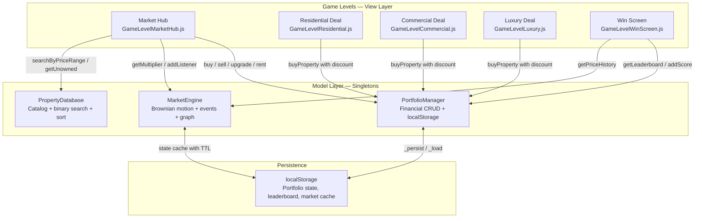
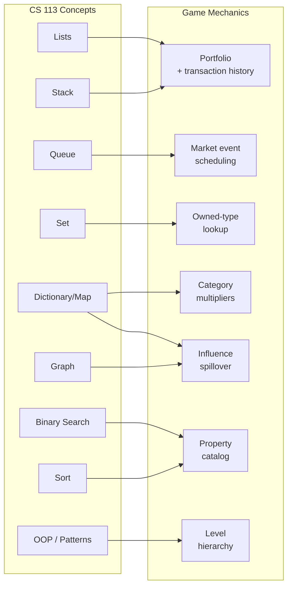
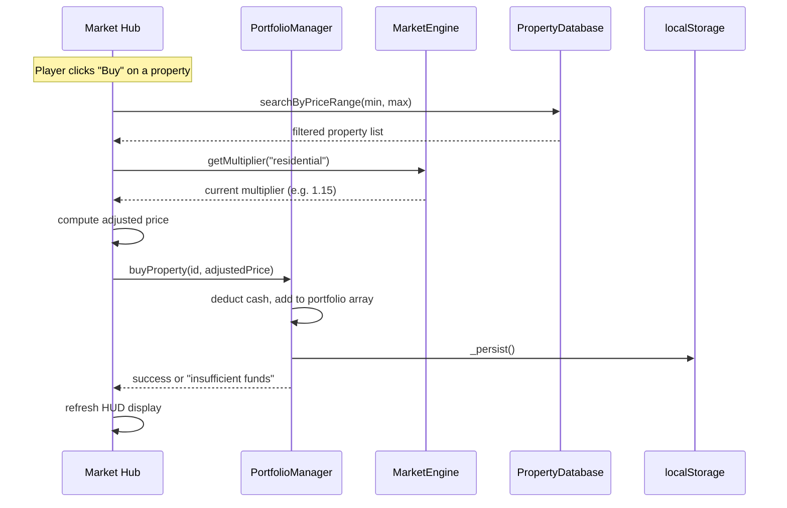
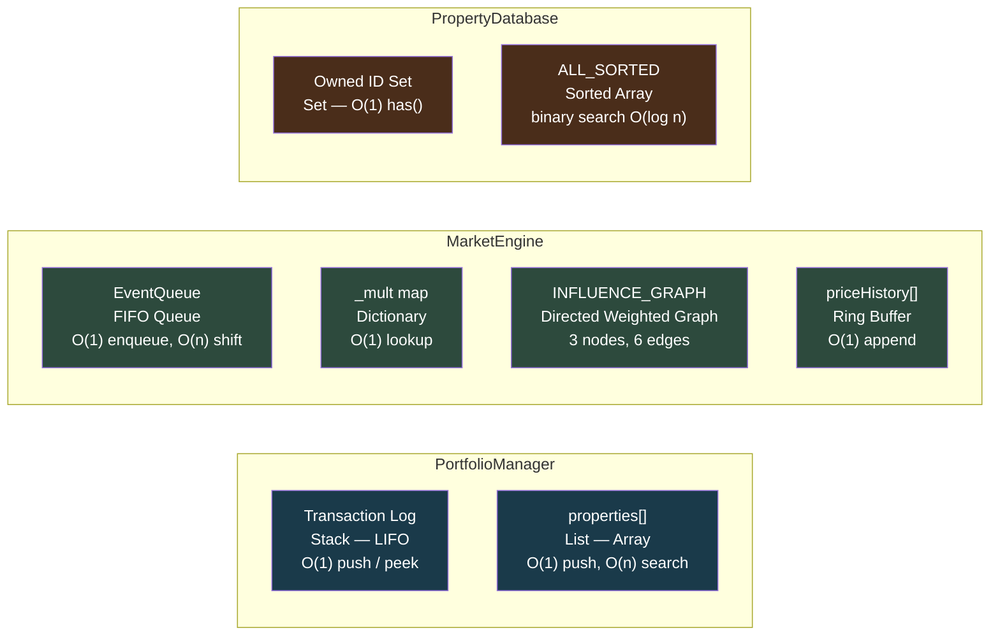
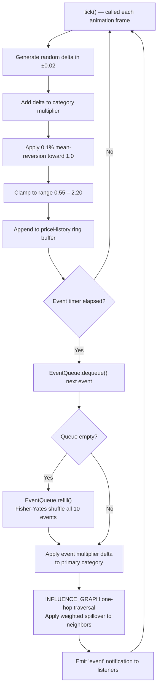
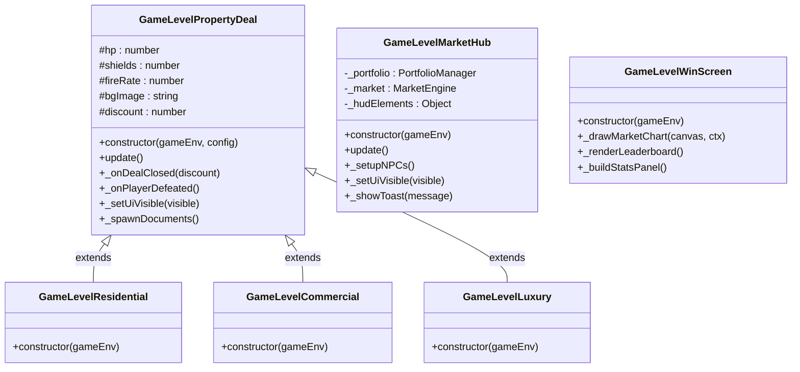
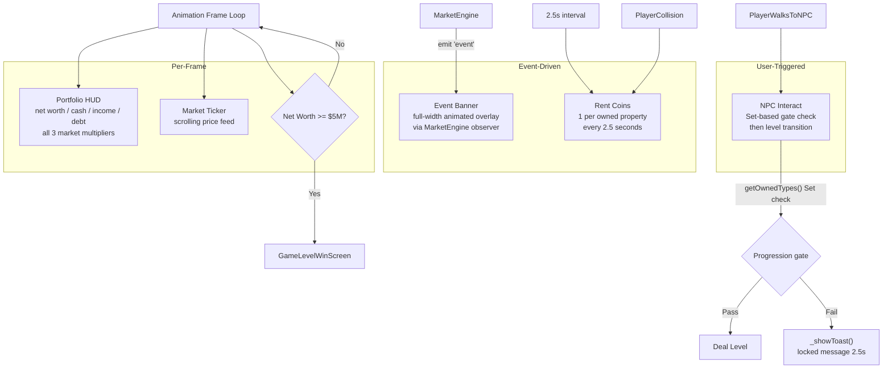
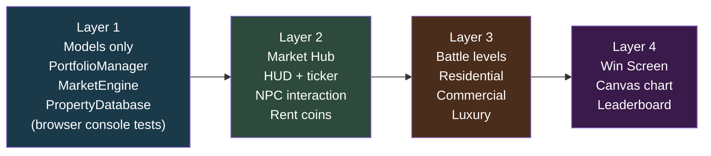

## Overview

Real Estate Tycoon is a browser-based investment simulation game I built for the CS 113 capstone sprint. Players start with $500,000 in cash and have to grow their net worth to $5,000,000 by buying, upgrading, and selling properties across three tiers — Residential, Commercial, and Luxury — while navigating a live market simulation that shifts prices based on random economic events and a directed influence graph connecting the three market categories.

I picked this project idea because financial math genuinely interests me, and I wanted to see how far I could push the GameEnginev1.1 framework beyond the standard platformer format. The answer turned out to be: pretty far, but it required building several systems the engine wasn't originally designed for — a persistent model layer, a real-time market ticker, a FIFO event scheduling queue, and a Canvas chart for the win screen, among others.

The game runs across five levels: a Market Hub world where you walk around and interact with broker NPCs, three deal levels (Residential, Commercial, Luxury) that use a negotiation battle mechanic to determine your purchase discount, and a Win Screen with a Canvas-rendered market history chart and a top-10 leaderboard. All portfolio state and the leaderboard persist across sessions via `localStorage`.

**Project source:** `_projects/games/real-estate-tycoon/`  
**Live game:** [/real-estate-tycoon](/real-estate-tycoon)

---

## Goals

Before getting into the technical breakdown, I want to give some context on what I was actually trying to accomplish — because it shaped every architectural decision in the project.

The sprint rubric required demonstrating all six CS 113 data structures, searching, sorting, Big-O analysis, OOP with the four pillars, and at least two design patterns — all in one cohesive project. My goal was to hit all of those not by bolting them onto something unrelated, but by having each concept emerge naturally from what the game actually needs.

That constraint pushed me toward a financial simulation. A portfolio is a natural list. Transactions form a stack. Market events need a queue. Owned property lookup benefits from sorting and binary search. Membership testing for property types is a Set operation. The market's influence model is a graph. Every concept had a real reason to exist in the codebase.

### Goals Completed

- [x] MVC architecture with three model singletons (`PortfolioManager`, `MarketEngine`, `PropertyDatabase`)
- [x] Five distinct game levels
- [x] Real-time market simulation via Brownian motion with mean-reversion and 10 economic event types
- [x] Negotiation battle system with HP bar, offers, counter-offers, and inspection bonuses
- [x] Full financial CRUD: buy, sell, upgrade, take loans, collect rent
- [x] Progression gate system (Commercial unlocks at 3 properties, Luxury at 6)
- [x] Leaderboard with localStorage persistence, top 10, cross-session
- [x] Win screen with Canvas market history chart and stat breakdown
- [x] 10 custom SVG character sprites and 4 background scenes

### Stretch Goals

- [x] Market Influence Graph: directed graph modeling price spillover across property categories
- [x] FIFO EventQueue: deck-based event scheduling instead of fully random selection
- [x] Binary search for properties by price range
- [x] Comparator-style sorting on portfolio and property catalog
- [x] Set-based owned-type tracking with O(1) membership tests
- [x] Big-O complexity annotations in JSDoc comments throughout model layer
- [ ] Spring Boot backend leaderboard — REST API + JPA (planned for v2.1)
- [ ] JUnit tests for model logic (planned for v2.1)
- [ ] Docker + nginx deployment (planned for v2.1)

---

## My Contributions

### 1. MVC Architecture and Model Layer

The hardest architectural decision I made early on was to keep all game state completely out of the level files. In most GameEnginev1.1 projects I had seen, state tends to leak into level constructors or global variables. I wanted to avoid that because it makes adding new levels painful — every new file needs to know where the state lives and how to interact with it.

My solution was three model singletons, each responsible for a clearly defined slice of state. The levels are purely views: they query the models, call model APIs to mutate state, and update their DOM or canvas output accordingly. No level ever writes directly to localStorage.

**`PortfolioManager.js`** handles everything financial. It is the only place in the codebase that reads from or writes to `localStorage` for portfolio data. The public API covers buying and selling properties, upgrading them (up to level 3, each upgrade costs 15–45% of purchase price and boosts monthly rent by 30%), taking loans (capped at 65% of current net worth at 6.5% APR), and collecting rent. Rent is prorated — the manager tracks the last collection timestamp and calculates elapsed game days (1 real minute = 1 game day) to determine what has accrued since the last collection. Net worth is computed dynamically on every call: cash + (each property's purchase price times its current market multiplier) minus total debt. The transaction log is a push-only array treated as a stack, so `peekLastTransaction()` is always O(1).

**`MarketEngine.js`** runs the live market simulation. On every animation tick, each of the three category multipliers (residential, commercial, luxury) steps via Brownian motion — a small random delta is added, then a 0.1% mean-reversion pull toward 1.0 is applied. Hard clamps at [0.55, 2.2] prevent the market from going completely off the rails. Economic events fire on a timer (every 25–85 seconds). Rather than picking events randomly each time, I pre-loaded a shuffled deck via `EventQueue.refill()` — a Fisher-Yates shuffle of all 10 event types — so every event fires once before any event can repeat. When an event fires, a one-hop traversal of `INFLUENCE_GRAPH` applies weighted spillover to neighboring categories: a residential boom nudges commercial prices up because that is how real markets behave.

**`PropertyDatabase.js`** is the static property catalog — 17 properties across three types and three price tiers. On first import, the full catalog is sorted once by price into `ALL_SORTED` (O(n log n), paid once at startup). `searchByPriceRange(min, max)` uses a binary search on `ALL_SORTED` to find the lower bound in O(log n), then collects all matching entries in O(k) where k is the result count. The `getUnowned` method was refactored late in development when I noticed the original implementation was doing O(n²) work — `Array.includes()` inside a filter loop. The fix was to build a `Set` of owned IDs first (O(k)), then call `Set.has()` inside the filter (O(1) per check).

---

### 2. Data Structures Implemented

None of these were chosen arbitrarily. Every data structure in the codebase is there because the access pattern for that particular data specifically calls for it.

| Structure | Where Used | Key Operations | Complexity |
|-----------|-----------|----------------|------------|
| Array / List | `properties[]`, `transactions[]`, price history ring buffer | push, iterate | O(1) push, O(n) iterate |
| Set | `getOwnedTypes()`, `getUnowned()` ID membership | build, membership test | O(n) build, O(1) has() |
| Stack | Transaction log (LIFO) — push via buy/sell, peek via `peekLastTransaction` | push, peek | O(1) both |
| Queue (FIFO) | `EventQueue` for ordered market event scheduling | enqueue, dequeue | O(1) enqueue, O(n) shift* |
| Dictionary / Map | `_mult` (category to multiplier), `INFLUENCE_GRAPH` adjacency map | key lookup | O(1) average |
| Graph | `INFLUENCE_GRAPH` directed adjacency map — 3 nodes, 6 weighted edges | one-hop traversal | O(V+E) |

*The FIFO queue uses `Array.shift()` internally, which is O(n). With at most 10 events in the queue this is negligible — a linked list would give true O(1) dequeue if the event catalog ever grew substantially.

---

### 3. Algorithms Implemented

| Algorithm | Location | Complexity |
|-----------|----------|------------|
| Binary search — `searchByPriceRange` | `PropertyDatabase.js` | O(log n + k) |
| Comparator sort — `sortBy`, `sortPortfolio` | `PropertyDatabase.js`, `PortfolioManager.js` | O(n log n) |
| Fisher-Yates shuffle — `getDealSelection`, `EventQueue.refill` | `PropertyDatabase.js`, `MarketEngine.js` | O(n) |
| Brownian motion with mean-reversion — `tick` | `MarketEngine.js` | O(1) per tick |
| One-hop graph traversal — spillover in `triggerEvent` | `MarketEngine.js` | O(V+E) |
| Linear search — `getById`, `EVENTS.find` | `PropertyDatabase.js`, `MarketEngine.js` | O(n) |
| Prorated rent formula — `collectRent` | `PortfolioManager.js` | O(k) properties |

A few of these deserve more explanation than a table can give.

The **binary search** in `searchByPriceRange` works on the pre-sorted `ALL_SORTED` array. It finds the leftmost index where price is greater than or equal to the minimum (a lower-bound search), then walks forward collecting entries until price exceeds the maximum. This is better than a linear scan when the catalog is large relative to the result window, which is the typical case when a player is browsing a specific price tier.

The **Brownian motion with mean-reversion** is the core of the market simulation. On each tick, a random delta in [-0.02, +0.02] is added to the current multiplier. Then a 0.1% pull toward 1.0 is applied regardless of direction. Without mean-reversion, prices drift without bound over time. Without the random delta, they slide to exactly 1.0 and stay there. The combination produces a realistic-looking random walk that stays within a plausible economic range.

The **graph traversal** for market spillover is intentionally kept to a single hop. When a residential event fires, the engine looks up `INFLUENCE_GRAPH["residential"]` and applies each edge's weight to the neighboring category's multiplier. Going more than one hop would cause chain reactions that compound to extreme values quickly — which was actually the bug I had before I limited the traversal depth.

---

### 4. OOP Design Patterns

**Inheritance and Polymorphism** — `GameLevelPropertyDeal` is the base class for all three deal levels. It holds all shared battle state (HP, shields, fire rate, coin count) and the complete game loop logic. Each subclass — `GameLevelResidential`, `GameLevelCommercial`, `GameLevelLuxury` — calls `super(gameEnv, config)` with different config values to set difficulty parameters. The same `update()` loop in the base class drives all three deal levels; subclasses do not override it, only the constructor parameters.

**Singleton** — Both `PortfolioManager` and `MarketEngine` are exported as `export default new ClassName()`. This ensures every level that imports either model gets the exact same instance. The alternative — instantiating a new object inside each level constructor — would mean the hub and a deal level would have separate, out-of-sync portfolio states, which is the bug I was trying to prevent from the start.

**Encapsulation** — All portfolio mutations go through `PortfolioManager`'s public API. Level code never touches the internal `_cache` object or writes directly to localStorage. Every mutating method calls `_persist()` at the end, enforcing the invariant that in-memory state always matches stored state.

**Abstraction** — `PropertyDatabase.searchByPriceRange(min, max)` looks like a simple call from the outside. Internally it depends on `ALL_SORTED` being pre-built on import, and uses a lower-bound binary search algorithm. Callers do not need to know any of that. If the implementation changes to a different search algorithm later, no level code changes.

---

### 5. Market Hub and Real-Time Systems

`GameLevelMarketHub.js` is the most complex file in the project. It runs six concurrent systems off the same game loop, and getting them to coexist cleanly — without any one system blocking or polluting another — took most of the time I spent on the hub.

1. **Portfolio HUD** — A DOM overlay in the top-right corner showing net worth, cash, monthly income, debt, and all three market multipliers. Updated every animation frame from live model queries. No state is stored in the HUD itself; it is purely a view.

2. **Market ticker** — A horizontally scrolling div at the bottom of the screen showing animated price data and event announcements. Content comes from `MarketEngine.getTickerText()`, which formats current multipliers and any active event name into a display string.

3. **Event banner** — When `MarketEngine` emits an `'event'` notification, the hub renders a full-width animated banner describing the event and its market impact. This uses the observer pattern — the hub registers a listener on initialization and removes it when tearing down.

4. **Rent coins** — Every 2.5 seconds, a floating coin sprite spawns from each owned property's position on the map. Player collision triggers `PortfolioManager.collectRent()`. Spawning is staggered so all coins do not appear simultaneously.

5. **NPC interaction** — Five broker NPCs have context-aware callbacks. Before entering Marcus's or Victoria's deal level, the hub calls `PortfolioManager.getOwnedTypes()` — which returns a `Set` — and checks the portfolio length against the progression requirement.

6. **Win condition polling** — Each frame, the hub calls `PortfolioManager.getNetWorth()` and compares it to $5,000,000. When that condition is met, it transitions to `GameLevelWinScreen`.

---

## Software Engineering Practices

Working on this project taught me as much about process as it did about data structures.

I built the game in four distinct layers: models first (with no levels at all, just browser console tests), then the hub level, then the battle levels, then the win screen. At each step I had something runnable. This made bugs much easier to isolate — if something broke after I added the hub, the model layer was definitely fine.

The `parentControl.resume` handshake between levels was the hardest thing to get right. When the player enters a deal level from the hub, all of the hub's DOM elements — HUD, ticker, coins — need to be hidden, otherwise they render on top of the battle canvas. When the player returns, they need to be restored exactly as they were. The engine's lifecycle hooks are not well-documented, so I had to read the `GameControl` source to understand when `resume` fires. The solution was `_setUiVisible(bool)`, a method that toggles the `display` style of every hub DOM element. It is called on level exit and hooked into `parentControl.resume` for restoration.

For version control, I used feature branches for each major subsystem: models, hub, battle levels, win screen. Each branch got a PR with a design notes doc attached before merging. This felt like extra overhead at the time but saved me at least twice when I needed to diff against a known-working commit after breaking the market simulation during refactoring.

All `localStorage` access is wrapped in try/catch. Private browsing mode and some browser extensions block localStorage, and without the try/catch the entire game would crash on load for those users. With it, the game falls back to in-memory defaults and continues running.

---

## Technical Concepts Applied

| CS 113 Area | Implementation |
|---|---|
| Lists | `properties[]` and `transactions[]` arrays with push, filter, and map operations |
| Stacks | Transaction log as LIFO stack; `peekLastTransaction()` is O(1) stack peek |
| Queues | `EventQueue` FIFO class; shuffled deck of 10 market events, dequeued in order |
| Sets | `getOwnedTypes()` returns `new Set`; `getUnowned()` builds Set for O(1) membership tests |
| Dictionaries / Maps | `_mult` map (category string to float), `INFLUENCE_GRAPH` adjacency map |
| Graphs | `INFLUENCE_GRAPH` directed graph, 3 nodes, 6 weighted edges; one-hop traversal models spillover |
| Searching | Binary search in `searchByPriceRange`; linear search in `getById` |
| Sorting | Comparator-style `sortBy(field, ascending)` and `sortPortfolio(field)` via Array.sort |
| Algorithm Analysis | O(log n), O(n log n), O(1), O(V+E) in JSDoc throughout all three model files |
| OOP Inheritance | `GameLevelPropertyDeal` as base; three concrete deal level subclasses |
| OOP Polymorphism | All three subclasses override only config via constructor injection; same interface consumed by GameControl |
| OOP Encapsulation | Private `_field` convention; all mutations through public API; `_persist()` called by every mutating method |
| OOP Abstraction | `searchByPriceRange` hides binary search; `getMultiplier` hides Brownian state |
| Design Patterns | Singleton (PortfolioManager, MarketEngine), MVC, Observer (market event listeners), Template Method (PropertyDeal subclasses) |
| Event-Driven | `MarketEngine.addListener / removeListener` pub/sub; NPC `interact()` callbacks; coin collision handlers |
| Canvas | Win-screen market history chart drawn with HTML5 Canvas 2D API — three polylines, axis labels, legend |
| Storage | `localStorage` with versioned keys and 5-minute TTL cache invalidation on market state |

---

## Key Challenges

**Sub-level HUD teardown** — Entering a deal level left the portfolio HUD, ticker, and rent coins rendering on top of the battle screen. This was not a canvas z-order issue — the DOM overlay was literally on top of the canvas element. The fix was `_setUiVisible(false)` on level entry, setting `display: none` on each hub element, and restoring them via `parentControl.resume`. Understanding when `resume` fires required reading the engine source, not the documentation.

**Brownian motion stability** — The first version of the market simulation had no mean-reversion and no clamps. Within about three minutes of gameplay, prices would drift to values above 4x or below 0.1x, making net worth calculations meaningless. The fix was two-part: add the 0.1% per-tick mean-reversion pull toward 1.0, and clamp the multiplier to [0.55, 2.2]. The clamp range took multiple playtests to calibrate — too narrow and the market feels completely flat, too wide and it becomes a lottery.

**Set vs. Array for ownership checks** — The original `getUnowned()` called `Array.includes()` inside a filter — O(n) per element, O(n²) overall for a catalog of size n and portfolio of size k. This is fine at 17 properties, but it communicates the wrong intent and would not scale. The refactor builds a `Set` from owned IDs (O(k)), then calls `Set.has()` inside the filter (O(1) per check), making the whole operation O(n + k). The performance difference at current scale is imperceptible; the improvement is in what the code communicates about its access pattern.

**Graph spillover calibration** — The first edge weights were too aggressive. A residential boom with weights of 0.8 to commercial and 0.5 to luxury caused price spikes that hit the 2.2x ceiling almost immediately. I tuned weights down through playtesting: residential to commercial at 0.25, commercial to luxury at 0.35, luxury to commercial at 0.20. The bidirectional relationships mean a rising luxury market also nudges commercial, which adds realism without causing runaway compounding.

**Progression gate UX** — The first version blocked NPC interaction silently when the player did not meet the property count requirement. Players had no idea why Marcus was not responding to them. The fix was `_showToast()`, which renders a temporary overlay message for 2.5 seconds explaining the lock reason without interrupting gameplay or requiring a modal dismiss.

---

## What I Learned

The biggest thing I took from this project is that data structure selection communicates intent, not just performance. When a future reader looks at `getUnowned()` and sees a Set being built from owned IDs, they immediately understand that membership testing is the primary operation and that it should be O(1). The array implementation communicates nothing about why it exists or what access pattern it's optimized for.

The market influence graph was the design decision I am most proud of. Instead of hardcoding per-event cross-category effects — which would mean editing multiple places every time a new event type is added — I put the relationships in data (a directed adjacency map) and wrote a generic one-hop traversal that reads from it. Adding a new event type now only requires an entry in the `EVENTS` array. The traversal logic does not change. That is what it looks like when structure is data rather than control flow.

The `EventQueue` taught me something about tradeoffs I did not fully understand before. Using `Array.shift()` for dequeue is O(n). A linked list implementation would be O(1). At 10 events, the difference is completely irrelevant. But writing the comment that explains why the simpler implementation is acceptable here — and what the threshold would be for needing to switch — is part of what algorithm analysis actually means in practice. Knowing when not to optimize is as important as knowing how.

---

## Future Goals

The Spring Boot leaderboard is the most meaningful planned extension. Right now, high scores only persist in `localStorage`, which means they are local to one browser on one device. A REST API — POST a score on win, GET top-10 on load — backed by Spring Boot and JPA would make competitive play possible across devices and users. The frontend change is small (two fetch calls replace the localStorage reads); the backend is more substantial.

JUnit tests for `PortfolioManager` would catch edge cases that are hard to test manually, particularly the loan cap calculation (65% of a dynamically computed net worth) and the binary search behavior at the boundaries (min = 0 or max = Infinity).

The AI advisor NPC is the stretch goal I most want to build. The idea is a Claude API integration — a financial advisor character who analyzes the player's current portfolio composition, debt level, market multipliers, and cash position, then returns a buy or sell recommendation with a confidence score. That would add real depth to the strategy layer and demonstrate a practical AI integration beyond what most student projects attempt.

---

## Overall Conclusions

MVC pays off as soon as you add a second level. Having all financial logic in `PortfolioManager` meant that adding the Win Screen — which needs total properties sold, peak net worth, time elapsed, and the full leaderboard — required zero changes to any level file. The data was already there; I just had to expose it through new getter methods.

Data structure choice communicates design intent. Switching from `Array.includes()` to `Set.has()` in `getUnowned()` improved asymptotic complexity, but the more important effect is that the code now tells the reader what access pattern to expect. The type carries information about how the data is meant to be used.

Graphs are more generally applicable than textbook examples suggest. Modeling market category relationships as a directed weighted adjacency map solved a real design problem — how to represent economic spillover without hardcoding cross-event effects — in a way that is both correct and extensible.

The `parentControl.resume` handshake was the hardest bug I encountered. Getting hub UI to tear down cleanly when entering a sub-level, and restore exactly when returning, required understanding the engine's lifecycle at a level the documentation did not cover. Reading framework source code directly is a skill I will use on every project going forward.

Polish is engineering. The gap between a game that technically works and one that feels good to play — animated tickers, floating rent coins, market event banners, smooth level transitions — is where most of the final time went. That polish is what makes users understand the game's systems without being told.
